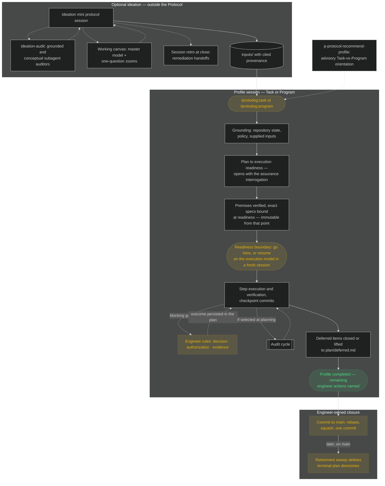
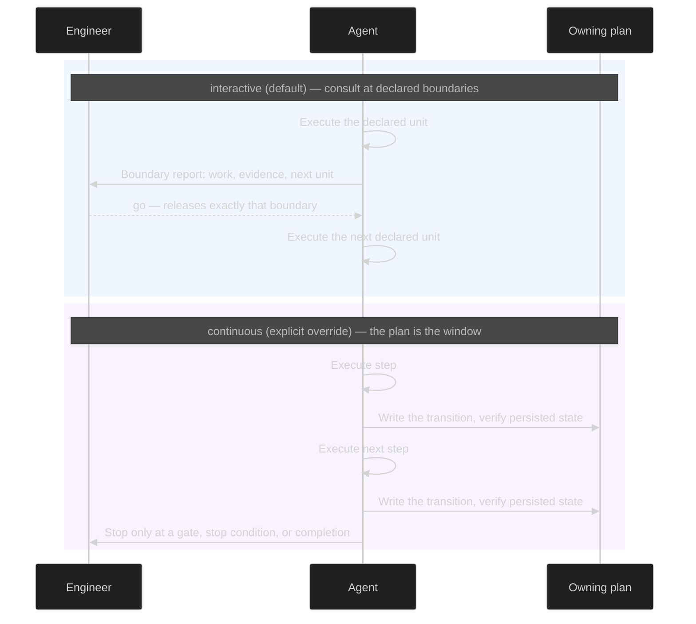
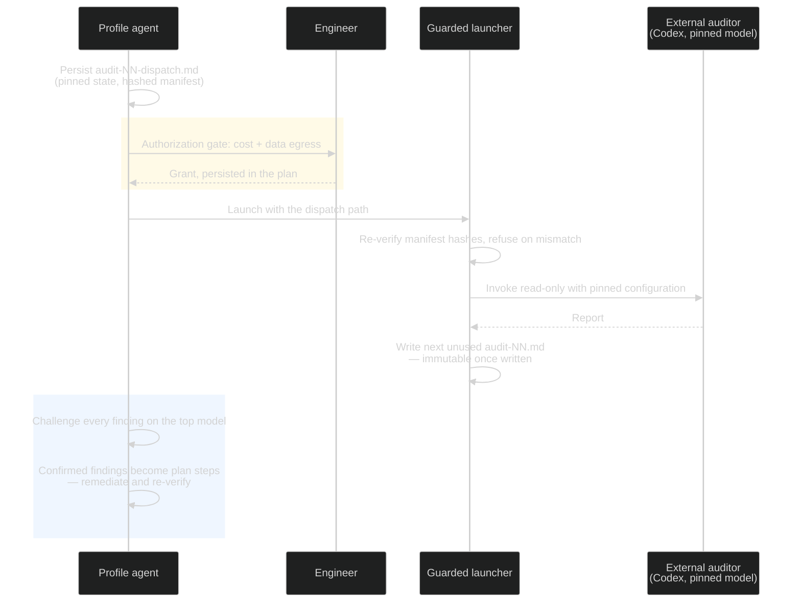
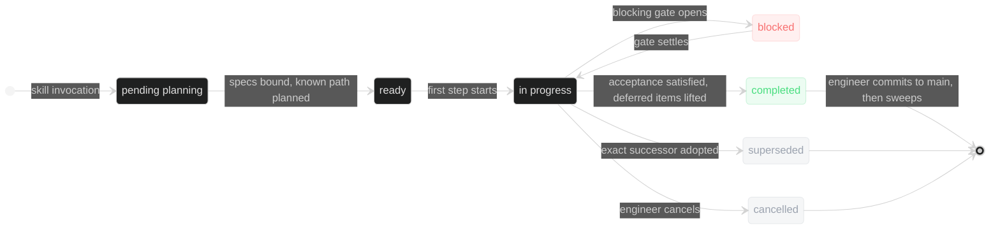

# Protodog

## What this is

Protodog is an execution protocol for agent-assisted engineering: one engineer's working
methodology encoded as installable machinery for Claude Code — skills as entry points, hooks and
validators as enforcement, Markdown artifacts in the repository as the only execution state. It
does not orchestrate models or generate code; it constrains how delegated work enters,
progresses, and reaches `main`, so every session runs under the same contract instead of whatever
the model woke up believing.

The concepts, in one pass. The engineer selects one of two **profiles** — Task (bounded
objective, one agent) or Program (multi-track, dispatched) — never the protocol itself. Context
moves through a provenance chain: `inputs/` (unvalidated material, including anything an external
model produced), `specs/` (reconciled intent, premises verified against the repository, immutable
once a plan binds it), `plan/` (live
state — steps, acceptance criteria, gates, decisions, all under stable IDs). **Gates** are the
human-in-the-loop core — decision, authorization, evidence — and authority is explicit:
model capability, tool access, and prior success never create permission. **Cadence** —
`interactive` by default, `continuous` by explicit override — sets how often the engineer is
consulted, and changes nothing else. **Assurance** scales
with risk, and an audit means independent, adversarial, and undirected within scope — executed
by a different vendor's model through a hash-pinned read-only launcher, never by the author
grading itself.

The discipline is mechanical wherever it can be: hooks deny engineer-owned Git (push, fetch,
rebase, history rewrites, `main`); validators reject malformed plans, marker/status drift,
unmapped acceptance, edits to bound specs or audit reports, and terminal plans still carrying
live obligations. Prose is reserved for judgment. Git is a split contract — the agent checkpoints
freely inside its managed worktree, the engineer owns the commit to main, and one Task or whole
Program reaches `main` as exactly one commit. Plans die on schedule: obligations close or lift to
a register, committed directories are swept, Git history is the archive.

What that buys: no per-session variance in how delegation works; no silent agent overreach; no
state rotting in chat scrollback — resumption is the plan plus the repository, nothing else; no
"done" without evidence — acceptance maps to checks, and a pass cannot be manufactured by
weakening one; no self-graded review; contained Git blast radius; no plan archaeology — the
working tree carries only what still decides something.

This file is the install and operations guide; the normative authority is `protodog/core/`, and
this README never overrides it.

## Contents

- [What this is](#what-this-is)
- [Prerequisites](#prerequisites)
- [Install](#install)
- [Release ritual](#release-ritual)
- [Verify](#verify)
- [Use](#use)
- [Notes](#notes)

## Prerequisites

- .NET SDK ≥ 10 (hooks, validators, and the audit launcher are file-based apps; no packages, no Node)
- bash, git
- Claude Code (skills + hooks host)
- Codex CLI, authenticated — only for launching independent audits

## Install

Once per engineer — the plugin follows you across repositories. This repository is a Claude Code
plugin marketplace (`kennel`) serving the `protodog` plugin. In Claude Code:

```text
/plugin marketplace add <path-or-git-url-of-this-repo>
/plugin install protodog@kennel
```

That single install gives every repository you open the skills, the pinned challenge agent type,
and the enforcement hooks — no per-repo copies, no settings merges. Per-repo opt-out: `/plugin disable protodog@kennel` in
that project. (`protodog/hooks/settings-fragment.json` remains only as the wiring fallback for a
repository that vendors `protodog/` directly.)

Per-engineer, editor-level (optional, host-portable prompts): `prompt-utility.code-snippets` is a
personal, repo-agnostic registry — install once at the VS Code user level, symlinked so this repo
stays the single canonical source:

```bash
ln -s "$(pwd)/protodog/registries/prompt-utility.code-snippets" \
  "$HOME/Library/Application Support/Code/User/snippets/prompt-utility.code-snippets"
```

`boxer.code-snippets` is a declared project family: copy it into the `.vscode/` of the BoxerUI
repositories that use it, nowhere else.

## Release ritual

Change → full sweep green → bump `protodog/.claude-plugin/plugin.json` version → `CHANGELOG.md`
entry → commit. Consumers pull with `/plugin marketplace update kennel` and
`/plugin update protodog`. Protocol changes to this repository ship as engineer-reviewed release
commits; a heavier change may run under Protodog itself (plans under `plan/`, specs under
`specs/`).

## Verify

```bash
./protodog/validators/test-validators.sh   # plan/spec/dispatch/register validation
./protodog/validators/test-registry.sh     # snippet registries
./protodog/hooks/test-hooks.sh             # enforcement fences (incl. plugin-mode resolution)
./protodog/scripts/test-audit-launch.sh    # launcher gates (dry-run, no Codex contact)
./protodog/scripts/test-sweep-check.sh     # retirement sweep-safety checker
```

CI runs the same five suites plus manifest checks on every push (macOS runner: the test drivers
use BSD sed).

## Use

### Ideate, then enter

Ideation is optional and happens outside the Protocol — in any host, by expanding a registry mini
protocol: `p-protocol-ideate-feature` (repository-grounded work shaping, ending in blast-radius
and profile orientation), `p-protocol-ideate-concept` (pure conceptual — approaches, abstractions,
no repository required), or `p-protocol-ideate-domain` (domain modeling).
Inside a Claude ideation session, `/protodog:ideation-audit` dispatches fresh-context adversarial
subagent audits — grounded in the repository and/or purely conceptual — of the session's settled
conclusions, so design concepts and logic are settled while they are still cheap to change.
For diagram-suited subjects — structure mappings, topologies, lifecycles, data flows —
`/protodog:working-canvas` keeps a working canvas from the baseline turn: one master model in
concern lanes plus one-question zooms, alternatives sketched in context before the prose
comparison, recolored at settlement and audit reconciliation, promotable at close. The same
doctrine follows work into the profiles — a gate in a diagram-suited domain presents its options
drawn in context, and execution recolors built work — with the canvas always a working view,
never state.
A heavy session can close with `p-protocol-retro` — a retrospective surfacing churn and dragged
uncertainties while they are fresh, shaping remediations as handoffs.
Ideation results enter the Protocol only as `inputs/` documents with cited provenance.

### One session, one profile

The profile choice is yours. Entering cold — without ideation's profile orientation — expand
`p-protocol-recommend-profile` for a grounded, decision-ready Task-vs-Program recommendation
(advisory only; no entry skill solicits it).
Start bounded work with `/protodog:task`, long-lived multi-track work with `/protodog:program`;
supply intent or exact `@inputs/` / `@specs/` references. Artifacts live under `inputs/`,
`specs/`, and `plan/<plan-id>/` of the repository you're in, per `protodog/core/foundation.md`.
Start the session on the model you want planning to run on — planning through execution readiness
belongs on the top tier, where binding immutability amplifies judgment error — and the readiness
boundary pauses in every cadence: it hands you the exact invocation to resume execution in a
fresh session on a cheaper model, or `go` continues in place.
Yellow below marks the engineer-owned moments; everything else is delegated agent work.



### Cadence

Cadence governs how often the engineer is consulted — nothing else. It never changes authority,
verification, or who commits; checkpoints happen at coherent verified units in either mode.

- **`interactive`** (default): proceed to the declared boundary — the first one normally a small,
  reversible, independently verified unit — report completed work, material evidence, and the
  next unit, then wait. `go` releases exactly the declared boundary and changes nothing else.
- **`continuous`** (explicit override, at invocation or any time): proceed through unambiguous
  planned work until a gate, a stop condition, a required engineer action, or completion. With no
  boundary reports, the plan is the engineer's only window — every status transition writes the
  owning plan and verifies the persisted state before dependent work proceeds.
- Cadence is profile-wide in a Task; a Program has a default with track and block overrides — the
  most specific active setting wins and expires with its scope. The engineer may intervene at any
  time, and in neither cadence are grounding, planning, or plan revision approval stops.



### Audit cycle

Audits and paid evaluation runs are scheduled at planning time: Task planning — and each track's
planning in a Program — opens with the assurance interrogation, so scheduling leaves planning as
settled state (a selected instrument with its placement or bounds, a gate for ruling, or an
explicit not-scheduled decision) instead of lingering uncertainty. When execution reaches the
declared placement, the agent
persists the self-contained dispatch pinning the exact state, and launch waits on an
authorization gate — cost plus data egress, since repository content leaves the boundary:

```bash
dotnet protodog/scripts/audit-launch.cs plan/<plan-id>/audits/audit-NN-dispatch.md
```

`--dry-run` verifies every gate without contacting Codex. Reports are immutable; a re-launch is a
new numbered cycle, and the challenge must address every report on file. Between launch and
report capture the manifested files are frozen — plan updates that would touch them queue and
flush after capture.



### Plan state and retirement

A plan cannot go terminal while it is the sole carrier of a live obligation: deferred issues and
accepted gaps lift to `plan/deferred.md` (template `protodog/templates/deferred-register.md`,
validated on write) or record their closure through disposition arrows (enforced) — a judgment
call, never a reflex move to the register. Terminal plan directories already on `main` are then
deleted by the engineer-triggered retirement sweep — Git history on `main` is the archive, which
the one-commit rule guarantees.



### Maintenance

Two engineer-invoked skills keep `plan/` honest. `/protodog:plan-sweep` is the retirement sweep:
a deterministic checker proves terminal + lifted + committed for every entry
(`dotnet protodog/scripts/sweep-check.cs`, usable standalone as the plan-tree survey), the skill
adds the one judgment step — citation liveness — and deletes only what you confirm, as one sweep
commit. `/protodog:deferred-review` hunts register drift: it verifies every parked row against
current repository state (closed by later work? trigger fired? claim still reproduces?) and
applies only the transitions you ratify. Profile completion offers this review against
just-finished work but never runs it unprompted — take the offer in a fresh session when the
closing context is degraded. The survey is a command, not a document — there is no index artifact
to maintain.

## Notes

- If hook invocation overhead matters, `dotnet publish protodog/hooks/protodog-hooks.cs`
  produces a native binary — point the hook commands at its output.
- Git boundary: the agent commits checkpoints inside its managed worktree; fetch/sync, rebase onto
  `main`, squash, the commit to main, cleanup, and plan retirement remain engineer-owned
  (`protodog/core/git-policy.md`).
- Hook denials log to `PROTOCOL_DENIAL_LOG` when set, else the plugin data directory
  (`CLAUDE_PLUGIN_DATA/protocol-denials.log`;
  repo-local fallback `protodog/logs/hook-denials.log`) — spikes after a model update signal
  protocol-fit regression; a hook that never fires is a deletion candidate.
- Provenance: extracted at v1.0.0 from the prototype workspace
  (`/Users/pablo/source/tmp/protocol`, commit `9ec6704`), which remains the frozen archive of the
  release-candidate lineage, AUDIT-01 cycle, and build history. Design rationale:
  `docs/design-rationale.md`.
