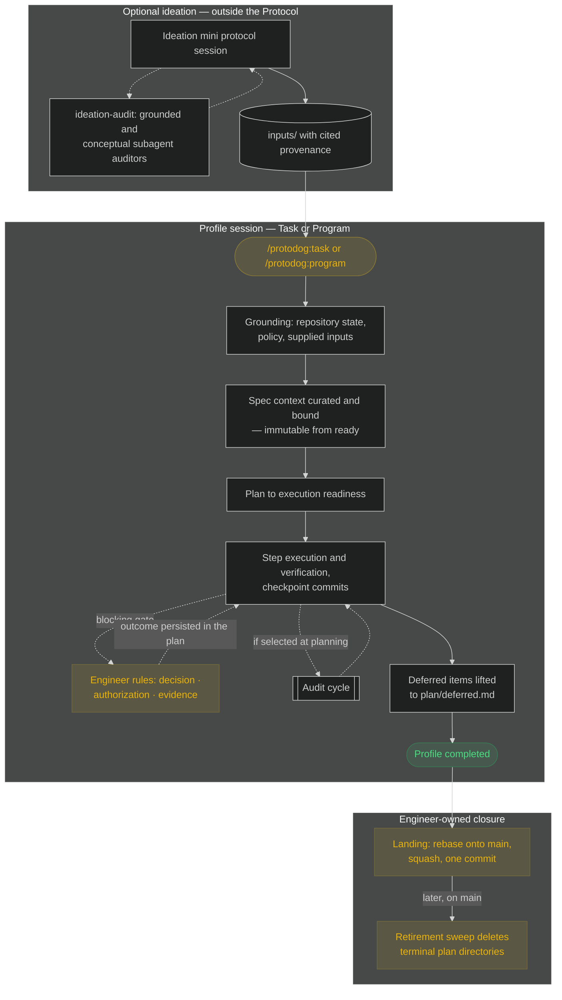
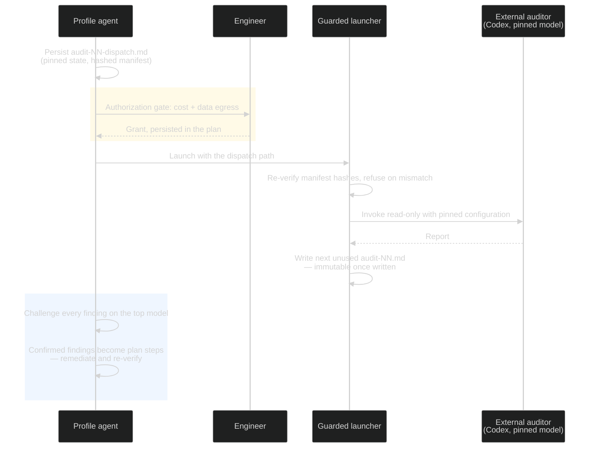

# Protodog

## Why this document exists

Installation and maintenance guide for Protodog, the Claude-native agentic execution protocol,
distributed from this repository as a Claude Code plugin. The normative authority is
`protodog/core/`; this file never overrides it.

## Contents

- [Why this document exists](#why-this-document-exists)
- [Prerequisites](#prerequisites)
- [Install](#install)
- [Release ritual](#release-ritual)
- [Verify](#verify)
- [Use](#use)
- [Notes](#notes)

## Prerequisites

- .NET SDK ≥ 10 (hooks, validators, and the audit launcher are file-based apps; no packages, no Node)
- bash, git
- Claude Code (skills + hooks host)
- Codex CLI, authenticated — only for launching independent audits

## Install

Once per engineer — the plugin follows you across repositories. This repository is a Claude Code
plugin marketplace (`kennel`) serving the `protodog` plugin. In Claude Code:

```text
/plugin marketplace add <path-or-git-url-of-this-repo>
/plugin install protodog@kennel
```

That single install gives every repository you open the entry skills and the enforcement hooks —
no per-repo copies, no settings merges. Per-repo opt-out: `/plugin disable protodog@kennel` in
that project. (`protodog/hooks/settings-fragment.json` remains only as the wiring fallback for a
repository that vendors `protodog/` directly.)

Per-engineer, editor-level (optional, host-portable prompts): `prompt-utility.code-snippets` is a
personal, repo-agnostic registry — install once at the VS Code user level, symlinked so this repo
stays the single canonical source:

```bash
ln -s "$(pwd)/protodog/registries/prompt-utility.code-snippets" \
  "$HOME/Library/Application Support/Code/User/snippets/prompt-utility.code-snippets"
```

`boxer.code-snippets` is a declared project family: copy it into the `.vscode/` of the BoxerUI
repositories that use it, nowhere else.

## Release ritual

Change → full sweep green → bump `protodog/.claude-plugin/plugin.json` version → `CHANGELOG.md`
entry → commit. Consumers pull with `/plugin marketplace update kennel` and
`/plugin update protodog`. Protocol changes to this repository run under Protodog itself (plans
under `plan/`, specs under `specs/`).

## Verify

```bash
./protodog/validators/test-validators.sh   # plan/spec/dispatch/register validation
./protodog/validators/test-registry.sh     # snippet registries
./protodog/hooks/test-hooks.sh             # enforcement fences (incl. plugin-mode resolution)
./protodog/scripts/test-audit-launch.sh    # launcher gates (dry-run, no Codex contact)
./protodog/scripts/test-sweep-check.sh     # retirement sweep-safety checker
```

CI runs the same five suites plus manifest checks on every push (macOS runner: the test drivers
use BSD sed).

## Use

### Ideate, then enter

Ideation is optional and happens outside the Protocol — in any host, by expanding a registry mini
protocol: `p-protocol-ideate-feature` (repository-grounded work shaping, ending in blast-radius
and profile orientation), `p-protocol-ideate-concept` (pure conceptual — approaches, abstractions,
no repository required), or `p-protocol-ideate-domain` (domain modeling).
Inside a Claude ideation session, `/protodog:ideation-audit` dispatches fresh-context adversarial
subagent audits — grounded in the repository and/or purely conceptual — of the session's settled
conclusions, so design concepts and logic are settled while they are still cheap to change.
Ideation results enter the Protocol only as `inputs/` documents with cited provenance.

### One session, one profile

Start bounded work with `/protodog:task`, long-lived multi-track work with `/protodog:program`;
supply intent or exact `@inputs/` / `@specs/` references. Artifacts land under `inputs/`,
`specs/`, and `plan/<plan-id>/` of the repository you're in, per `protodog/core/foundation.md`.
Sessions start `interactive` — proceed to a declared boundary, report, wait — and may be switched
to `continuous`, where the plan itself is the engineer's window on progress. Yellow below marks
the engineer-owned moments; everything else is delegated agent work.



### Audit cycle

Audits are selected at planning time. When execution reaches the declared placement, the agent
persists the self-contained dispatch pinning the exact state, and launch waits on an
authorization gate — cost plus data egress, since repository content leaves the boundary:

```bash
dotnet protodog/scripts/audit-launch.cs plan/<plan-id>/audits/audit-NN-dispatch.md
```

`--dry-run` verifies every gate without contacting Codex. Reports are immutable; a re-launch is a
new numbered cycle, and the challenge must address every report on file.



### Plan state and retirement

A plan cannot go terminal while it is the sole carrier of a live obligation: deferred issues and
accepted gaps lift to `plan/deferred.md` (template `protodog/templates/deferred-register.md`,
validated on write) or record their closure through disposition arrows (enforced). Terminal,
landed plan directories are then deleted by the engineer-triggered retirement sweep — Git history
on `main` is the archive, which one-commit landing guarantees.


### Maintenance

Two engineer-invoked skills keep `plan/` honest. `/protodog:plan-sweep` is the retirement sweep:
a deterministic checker proves terminal + lifted + landed for every entry
(`dotnet protodog/scripts/sweep-check.cs`, usable standalone as the plan-tree survey), the skill
adds the one judgment step — citation liveness — and deletes only what you confirm, as one sweep
commit. `/protodog:deferred-review` hunts register drift: it verifies every parked row against
current repository state (closed by later work? trigger fired? claim still reproduces?) and
applies only the transitions you ratify. The survey is a command, not a document — there is no
index artifact to maintain.

## Notes

- Warm hook latency is ~190 ms per invocation. If that matters,
  `dotnet publish protodog/hooks/protodog-hooks.cs` produces a native binary — point the hook
  commands at its output.
- Git boundary: the agent commits checkpoints inside its managed worktree; fetch/sync, rebase onto
  `main`, squash, landing, cleanup, and plan retirement remain engineer-owned
  (`protodog/core/git-policy.md`).
- Hook denials log to the plugin data directory (`CLAUDE_PLUGIN_DATA/protocol-denials.log`;
  repo-local fallback `protodog/logs/hook-denials.log`) — spikes after a model update signal
  protocol-fit regression; a hook that never fires is a deletion candidate.
- Provenance: extracted at v1.0.0 from the prototype workspace
  (`/Users/pablo/source/tmp/protocol`, commit `9ec6704`), which remains the frozen archive of the
  release-candidate lineage, AUDIT-01 cycle, and build history. Design rationale:
  `docs/design-rationale.md`.
